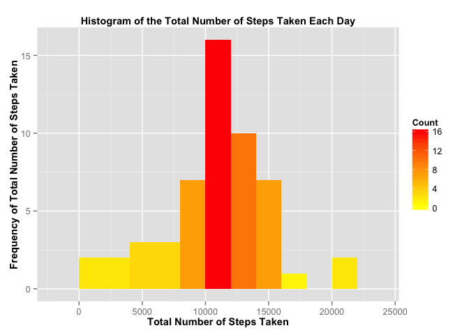
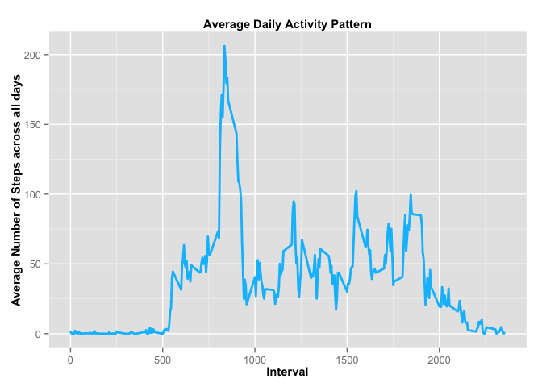
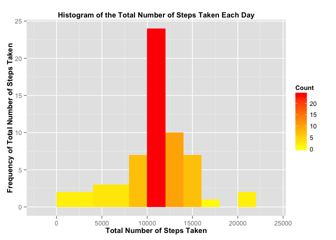
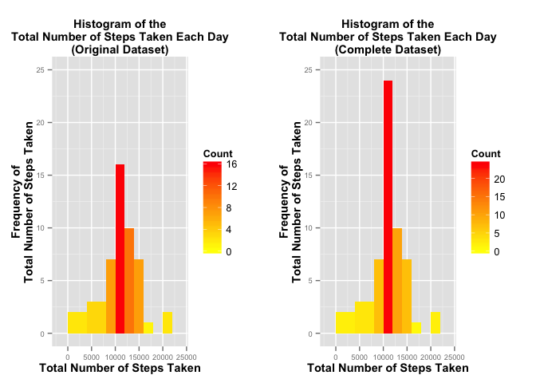
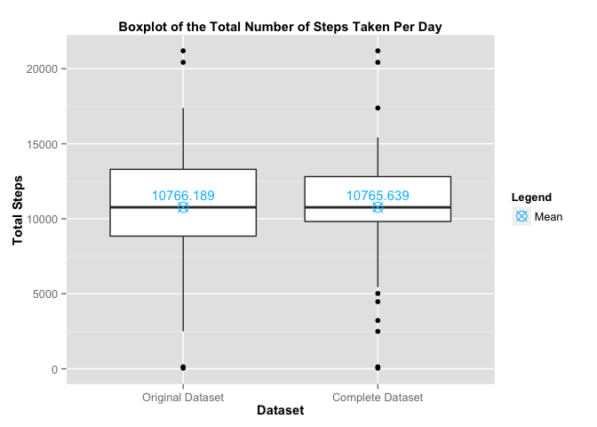
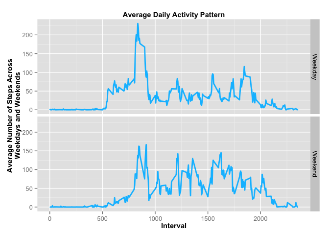

# Reproducible Research: Peer Assessment 1

## Loading libraries

```r
library(ggplot2)
library(grid)
library(gridExtra)
library(tidyr)
```

## Loading and preprocessing the data
Convert the date variable from type Factor to type Date

```r
data <- read.csv("activity.csv")
data$date <- as.Date(data$date , "%Y-%m-%d")
```

## What is mean total number of steps taken per day?

Calculates the total number of steps taken each day

```r
sumSteps<-aggregate(data$steps,by=list(data$date), FUN=sum)
names(sumSteps)<-c("date","steps")
```

Plots the histogram showing the total number of steps taken each day

```r
ggplot(data=sumSteps, aes(x=steps, fill=..count..)) + 
        geom_histogram(stat="bin", binwidth = 2000) +
        labs(title="Histogram of the Total Number of Steps Taken Each Day",
             x="Total Number of Steps Taken",
             y="Frequency of Total Number of Steps Taken") +
        scale_fill_gradient("Count", low = "yellow", high = "red") +
        theme(plot.title=element_text(face="bold",size=11),
              axis.title=element_text(face="bold",size=11)) 
```

 

Calculates the mean and median of the total number of steps taken per day

```r
meanSteps = round(mean(sumSteps$steps, na.rm=TRUE), 3)
medianSteps = round(median(sumSteps$steps, na.rm=TRUE), 3)
```

**The mean total number of steps taken per day is:**

```r
meanSteps
```

```
## [1] 10766.19
```

**The median total number of steps taken per day is:**

```r
medianSteps
```

```
## [1] 10765
```

## What is the average daily activity pattern?
Plot a time series plot of the 5-minute interval and the average number of steps taken, averaged across all days.

```r
avgActivityPattern<-aggregate(data$steps[!is.na(data$steps)],
                              by=list(data$interval[!is.na(data$steps)]), 
                              FUN=mean)
names(avgActivityPattern)<-c("Interval","AverageSteps")
ggplot(data=avgActivityPattern, aes(x=Interval, y=AverageSteps)) + 
        geom_line(size=1, colour="#00bfff") + 
        labs(title="Average Daily Activity Pattern",
             x="Interval",
             y="Average Number of Steps across all days") +
        theme(plot.title=element_text(face="bold",size=11),
              axis.title=element_text(face="bold",size=11)) 
```

 

Determine which 5-minute interval, on average across all the days in the dataset, contains the maximum number of steps

```r
maxInterval = avgActivityPattern[avgActivityPattern$AverageSteps==max(avgActivityPattern$AverageSteps),]$Interval
```

**The maximum number of steps for the 5-minute interval averaged across all the days is during the interval is:**

```r
maxInterval
```

```
## [1] 835
```

## Imputing missing values
**The total number of missing values in the dataset is:**

```r
nrow(data[is.na(data$steps),])
```

```
## [1] 2304
```

**The strategy for filling all of the missing values in the dataset would be to use the average number of steps for the 5-minute interval, averaged across all days.**

Compute the average number of steps for the 5-minute interval, average across all days.

```r
avgActivityPattern<-round(aggregate(data$steps[!is.na(data$steps)],
                              by=list(data$interval[!is.na(data$steps)]), 
                              FUN=mean),0)
names(avgActivityPattern)<-c("interval","averageSteps")
```

Use the average number of steps for the 5-minute interval to fill in the missing values in the dataset. Construct a new dataset and store it in the variable **completeData**.

```r
completeData <- merge(data,avgActivityPattern, by="interval")
completeData$steps[is.na(completeData$steps)] <- 
        completeData$averageSteps[is.na(completeData$steps)]
```

Calculates the total number of steps taken each day with the complete dataset.

```r
sumCompleteSteps<-aggregate(completeData$steps,by=list(completeData$date), FUN=sum)
names(sumCompleteSteps)<-c("date","steps")
```

Plot a histogram of the total number of steps taken each day with the complete data.

```r
ggplot(data=sumCompleteSteps, aes(x=steps, fill=..count..)) + 
        geom_histogram(stat="bin", binwidth = 2000) +
        labs(title="Histogram of the Total Number of Steps Taken Each Day",
             x="Total Number of Steps Taken",
             y="Frequency of Total Number of Steps Taken") +
        scale_fill_gradient("Count", low = "yellow", high = "red") +
        theme(plot.title=element_text(face="bold",size=11),
              axis.title=element_text(face="bold",size=11)) 
```

 

Calculates the mean and median of the total number of steps taken per day with the complete data.

```r
meanCompleteSteps <- round(mean(sumCompleteSteps$steps, na.rm=TRUE), 3)
medianCompleteSteps <- round(median(sumCompleteSteps$steps, na.rm=TRUE), 3)
```

**The mean total number of steps taken per day is:**

```r
meanCompleteSteps
```

```
## [1] 10765.64
```

**The median total number of steps taken per day is:**

```r
medianCompleteSteps
```

```
## [1] 10762
```

**Compares if the values differ from the estimates from the original dataset and the impact of imputing missing data on the estimates of the total daily number of steps**

First, we will look at histograms created with both the complete dataset and the original dataset.

```r
plot1<- ggplot(data=sumSteps, aes(x=steps, fill=..count..)) + 
        geom_histogram(stat="bin", binwidth = 2000) +
        labs(title="Histogram of the\nTotal Number of Steps Taken Each Day\n(Original Dataset)",
             x="Total Number of Steps Taken",
             y="Frequency of\nTotal Number of Steps Taken") +
        scale_fill_gradient("Count", low = "yellow", high = "red") +
        ylim(0,25) +
        theme(plot.title=element_text(face="bold",size=11),
              axis.title=element_text(face="bold",size=11),
              axis.text=element_text(size=7)) 

plot2<- ggplot(data=sumCompleteSteps, aes(x=steps, fill=..count..)) + 
        geom_histogram(stat="bin", binwidth = 2000) +
        labs(title="Histogram of the\nTotal Number of Steps Taken Each Day\n(Complete Dataset)",
             x="Total Number of Steps Taken",
             y="Frequency of\nTotal Number of Steps Taken") +
        scale_fill_gradient("Count", low = "yellow", high = "red") +
        ylim(0,25) +
        theme(plot.title=element_text(face="bold",size=11),
              axis.title=element_text(face="bold",size=11),
              axis.text=element_text(size=7)) 

grid.arrange(plot1,plot2,ncol=2)
```

 

Next, we will combine the complete and incomplete data into a single dataset with a new factor variable indicating if they are from the Complete Dataset (ie. data set with imputed values) or the Original Dataset. 

```r
temp1 <- data
temp1$set <- as.factor("Original Dataset")
temp2 <- completeData[,c(2,3,1)]
temp2$set <- as.factor("Complete Dataset")
alldata <- rbind(temp1,temp2)
alldata <- alldata[!is.na(alldata$steps),]
sumAlldata <- as.data.frame(aggregate(alldata$steps,by=list(alldata$date, alldata$set), FUN=sum))
colnames(sumAlldata) <- c("date","set","steps")
```

We will then create a data frame of the means for the 2 datasets. 

```r
meansData <- data.frame(c(meanSteps,meanCompleteSteps))
meansData <- cbind(meansData,c("Original Dataset","Complete Dataset"))
colnames(meansData) <- c("steps","set")
```

Lastly, we will look at the boxplot here showing the mean and median of the 2 datasets.

```r
ggplot(sumAlldata, aes(x=factor(set), y=steps)) +
        geom_boxplot() + 
        labs(title="Boxplot of the Total Number of Steps Taken Per Day",
             x="Dataset",
             y="Total Steps") +
        theme(plot.title=element_text(face="bold",size=11),
              axis.title=element_text(face="bold",size=11),
              legend.position="right") +
        geom_text(data=meansData, show_guide=FALSE,
                  aes(label=meansData$steps, y=meansData$steps+800, colour="mean"), size=4) +
        geom_point(data=meansData,
                   aes(y=meansData$steps, colour="mean", shape="cross"), size=4) +
        scale_colour_manual("Legend", labels=c("Mean"), values=c("mean"="#00bfff")) + 
        scale_shape_manual("Legend", labels=c("Mean"), values=c("cross"=13))
```

 

**We can see from the histogram and boxplot that the values do not differ much between the Original Dataset and the Complete Dataset. The distribution of the 2 datasets also remained similar.**

## Are there differences in activity patterns between weekdays and weekends?

Create a new factor variable in the dataset with two levels – “Weekday” and “Weekend” indicating whether a given date is a weekday or weekend day.  

At the same time, create the dataset needed for plotting the panel plot containing the time series plot of the 5-minute interval and the average number of steps taken, averaged across all weekday days or weekend days.

```r
completeData$day<-factor(ifelse
                             (weekdays(completeData$date) %in% 
                                      c("Saturday","Sunday"),"Weekend","Weekday"))

avgCompleteData <- tapply(completeData$steps, 
                          INDEX=list(completeData$day,completeData$interval), 
                          FUN=mean)

avgCompleteData <- as.data.frame(avgCompleteData)
avgCompleteData$Day <- rownames(avgCompleteData)

plotdata <- gather(avgCompleteData, Interval, AverageSteps, 1:288)
plotdata$Day <- as.factor(plotdata$Day)
plotdata$Interval <- as.integer(as.character(plotdata$Interval))
```

Plot the number of steps taken for the 5-minute interval and the average number of steps taken, averaged across all weekday days or weekend days.

```r
ggplot(data=plotdata, aes(x=Interval, y=AverageSteps)) + 
        geom_line(size=1, colour="#00bfff") + 
        labs(title="Average Daily Activity Pattern",
             x="Interval",
             y="Average Number of Steps Across\nWeekdays and Weekends") +
        facet_grid(Day~.) +
        theme(plot.title=element_text(face="bold",size=11),
              axis.title=element_text(face="bold",size=11)) 
```

 
